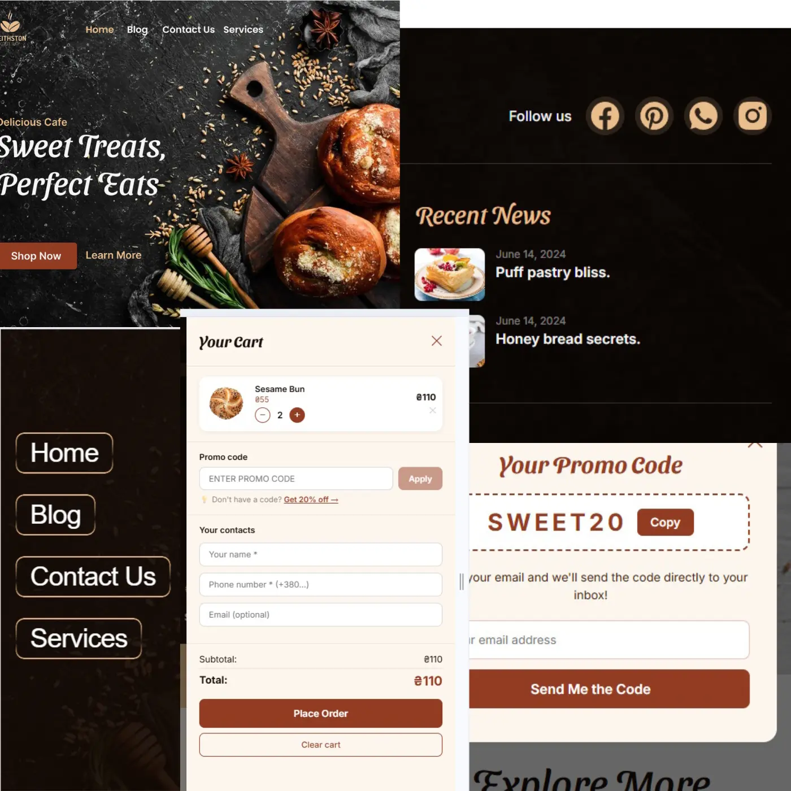

# 🥐 Keithston Bakery

A modern, fully responsive bakery website built with React + Vite.
Crafted as a portfolio project to practice real-world frontend development.

## 🚀 Live Demo

[bakery-website-react-alexander.vercel.app](https://bakery-website-react-alexander.vercel.app)



## 🛠️ Tech Stack

- **React 19** — component-based UI
- **Vite** — lightning fast build tool
- **CSS Modules** — scoped, conflict-free styles
- **modern-normalize** — CSS reset
- **Telegram Bot API** — order & promo notifications without backend
- **localStorage** — cart persistence across sessions

## 📦 Features

- 📱 Fully responsive — mobile / tablet / desktop (375px / 768px / 1440px)
- 🍔 Mobile menu with ripple effect and slide-in animation
- ✨ Animated rotating border on navigation links
- 🛒 Shopping cart — add/remove items, quantity control
- 💾 Cart saved to localStorage — persists after page refresh
- 💳 Order form with name, phone validation
- 📬 Orders sent directly to Telegram bot
- 🎁 Promo code system with 20% discount validation
- 💡 Reminder to claim discount if ordering without promo code
- 🔄 Infinite scroll marquee for product rows (two directions)
- 🖼️ Explore gallery with category filters and Load More
- 🌟 Popular picks section
- 📰 Recipe modal in footer with ingredients and instructions
- 🔢 Animated counter triggered by scroll (IntersectionObserver)
- 🏠 Fixed transparent header — darkens on scroll
- 📲 Mobile select filter / desktop button tabs for gallery

## 🏗️ Project Structure

src/
├── components/
│ ├── Header/
│ ├── MobileMenu/
│ ├── Hero/
│ ├── Products/
│ ├── Featured/
│ ├── AboutUs/
│ ├── Order/
│ ├── ExploreMore/
│ ├── Cart/
│ └── Footer/
├── data/
│ └── products.json
├── styles/
│ └── global.css
└── App.jsx

## 🚀 Getting Started

```bash
# Clone the repo
git clone https://github.com/Bashmachok1982/Bakery-Website-react-Alexander.git

# Install dependencies
npm install

# Start dev server
npm run dev

# Build for production
npm run build
```

## 🔑 Environment Variables

Create `.env` file in root:
VITE_TELEGRAM_BOT_TOKEN=your_bot_token
VITE_TELEGRAM_CHAT_ID=your_chat_id

## 📚 What I Learned

- React hooks — `useState`, `useEffect`, `useRef`
- Lifting state up and passing props
- Controlled forms with validation
- CSS Modules and responsive design mobile-first
- Component architecture
- localStorage for data persistence
- Telegram Bot API integration without backend
- IntersectionObserver for scroll-triggered animations
- CSS animations — rotating border, wiggle, ripple, marquee
- Lazy loading images for performance
- Adaptive images with `srcSet` for retina displays
- Native select styling for mobile filters

---

Design inspired by [Bakery Website UI](https://www.figma.com/design/TH9n5z0pX18QSzqXimUQSm/Bakery-Website-Ui--Community-/)

Made with ❤️ and a lot of 🥐
